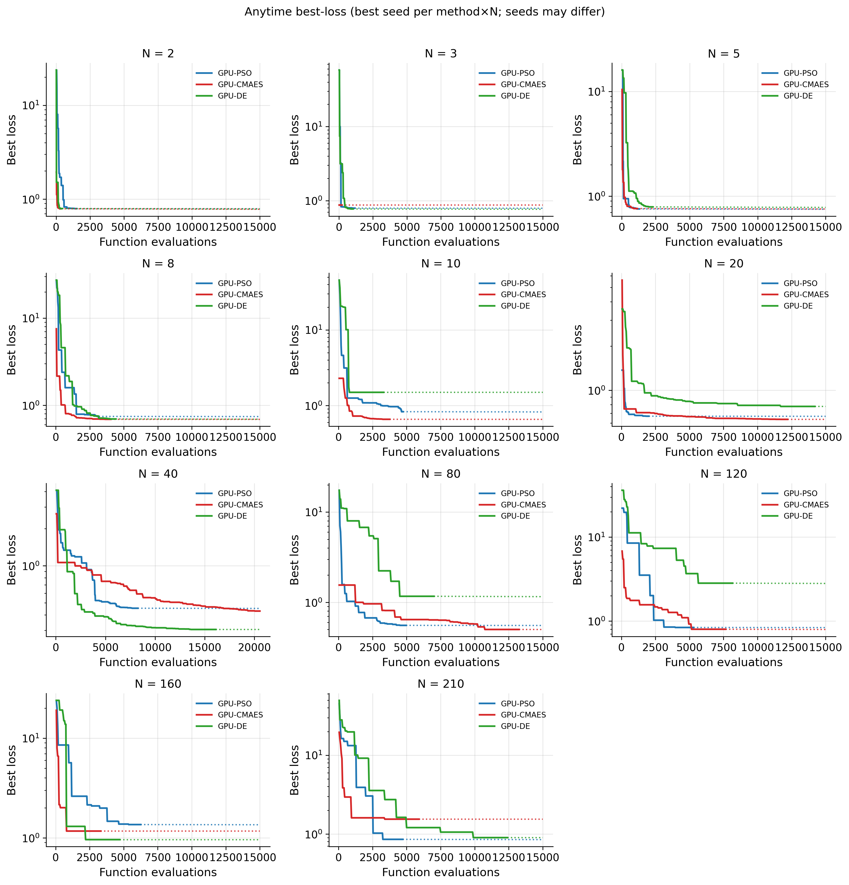
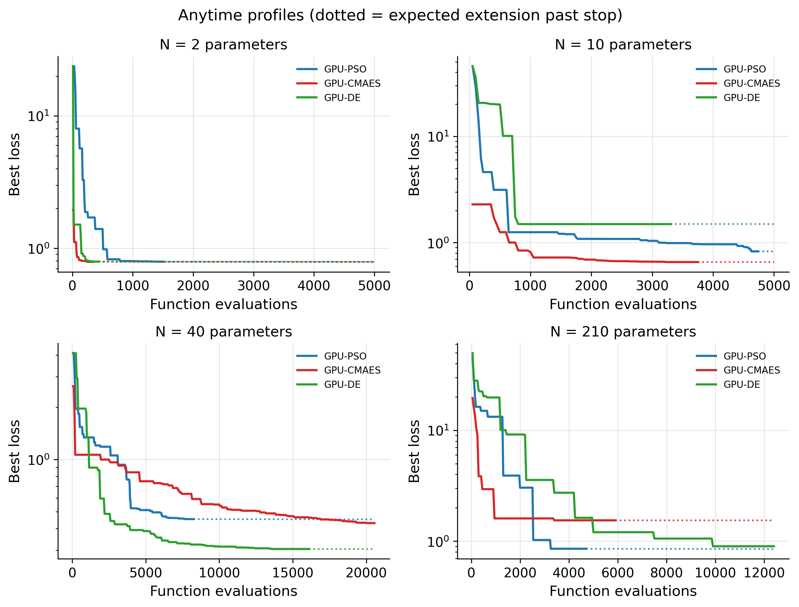
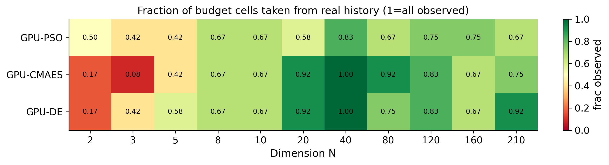
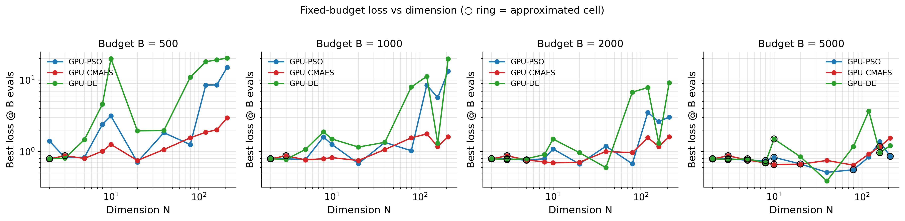
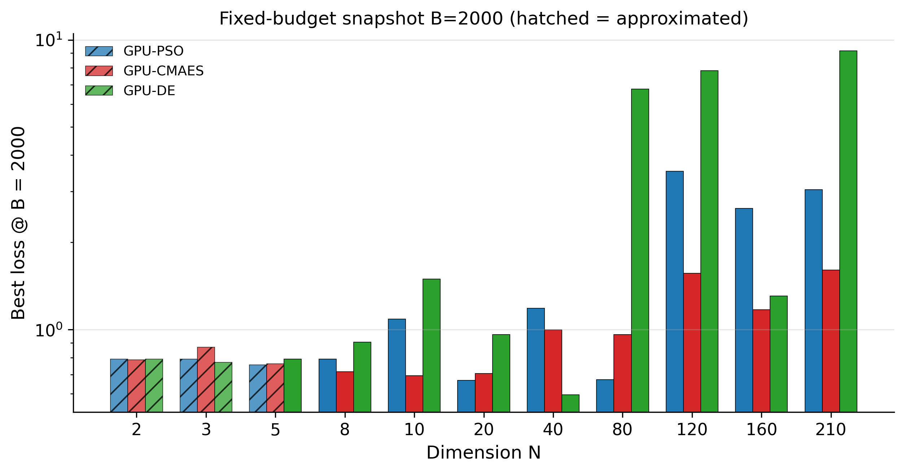
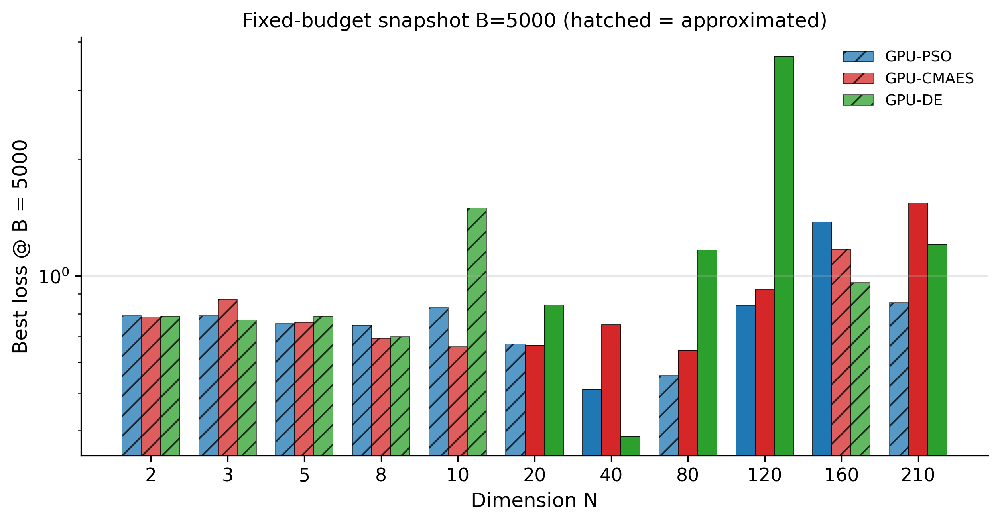
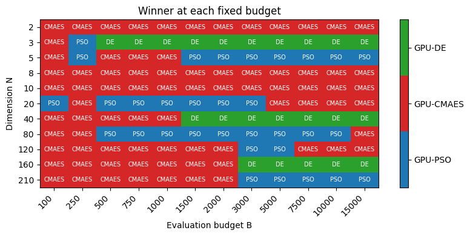

# Fixed-budget analysis: GPU-PSO vs GPU-CMAES vs GPU-DE

## Scope and data (history + best-of-seeds)

Primary data are **completed historical runs** from any seed available. **Seeds are not required to match** across methods. When several seeds exist for the same `(method, N)`, the analysis keeps the run with the **lowest final loss** and uses that anytime curve for fixed-budget readouts. Budget cells beyond early stops use documented approximations.

- **GPU-PSO**: `GPU-pso/results/sweep_gpu7_w16/` (+ seed2 dirs when present)
- **GPU-CMAES**: `GPU-cmaes/results/sweep_gpu1_w16/` (+ seed2 dirs when present)
- **GPU-DE**: `GPU-de/results/sweep_gpu0_w16/` (+ seed2 dirs when present)
  - seed2: `GPU-pso/results/sweep_gpu7_w16_seed2_random/`
  - seed2: `GPU-cmaes/results/sweep_gpu1_w16_seed2_random/`
  - seed2: `GPU-de/results/sweep_gpu_all_w16_seed2_random/`

Dimensions: **[2, 3, 5, 8, 10, 20, 40, 80, 120, 160, 210]**.

### Selected run (best final_loss) per method × N

| method | n_params | seed | final_loss | total_evals | case |
| --- | --- | --- | --- | --- | --- |
| GPU-CMAES | 2 | 42 | 0.7879 | 350 | 2P_203_200 |
| GPU-DE | 2 | 42 | 0.7918 | 440 | 2P_203_200 |
| GPU-PSO | 2 | 42 | 0.7904 | 1500 | 2P_203_200 |
| GPU-CMAES | 3 | 42 | 0.8702 | 195 | 3P_203_200_194 |
| GPU-DE | 3 | 42 | 0.7714 | 1020 | 3P_203_200_194 |
| GPU-PSO | 3 | 42 | 0.7898 | 1155 | 3P_203_200_194 |
| GPU-CMAES | 5 | 42 | 0.7619 | 1125 | 5P_203_150_200_194_181 |
| GPU-DE | 5 | 42 | 0.7901 | 2275 | 5P_203_150_200_194_181 |
| GPU-PSO | 5 | 42 | 0.7557 | 1276 | 5P_203_150_200_194_181 |
| GPU-CMAES | 8 | 42 | 0.6911 | 4040 | 8P_150_154_167_181_188_194_200_203 |
| GPU-DE | 8 | 42 | 0.6971 | 4400 | 8P_150_154_167_181_188_194_200_203 |
| GPU-PSO | 8 | 42 | 0.7466 | 3156 | 8P_150_154_167_181_188_194_200_203 |
| GPU-CMAES | 10 | 42 | 0.6576 | 3750 | 10P_118_150_154_167_181_188_190_194_200_203 |
| GPU-DE | 10 | 42 | 1.495 | 3300 | 10P_118_150_154_167_181_188_190_194_200_203 |
| GPU-PSO | 10 | 42 | 0.8287 | 4737 | 10P_118_150_154_167_181_188_190_194_200_203 |
| GPU-CMAES | 20 | 2 | 0.6356 | 12200 | 20P_seed2 |
| GPU-DE | 20 | 42 | 0.778 | 14200 | 20P_seed42 |
| GPU-PSO | 20 | 2 | 0.6679 | 2003 | 20P_seed2 |
| GPU-CMAES | 40 | 2 | 0.4295 | 20550 | 40P_seed2 |
| GPU-DE | 40 | 42 | 0.3044 | 16100 | 40P_seed42 |
| GPU-PSO | 40 | 42 | 0.4528 | 8248 | 40P_seed42 |
| GPU-CMAES | 80 | 2 | 0.4996 | 13250 | 80P_seed2 |
| GPU-DE | 80 | 42 | 1.166 | 7000 | 80P_seed42 |
| GPU-PSO | 80 | 42 | 0.5547 | 4955 | 80P_seed42 |
| GPU-CMAES | 120 | 2 | 0.7979 | 7650 | 120P_seed2 |
| GPU-DE | 120 | 42 | 2.826 | 8150 | 120P_seed42 |
| GPU-PSO | 120 | 42 | 0.8377 | 5290 | 120P_seed42 |
| GPU-CMAES | 160 | 42 | 1.172 | 3300 | 160P_seed42 |
| GPU-DE | 160 | 42 | 0.9619 | 4700 | 160P_seed42 |
| GPU-PSO | 160 | 42 | 1.362 | 6237 | 160P_seed42 |
| GPU-CMAES | 210 | 2 | 1.542 | 5900 | 210P_seed2 |
| GPU-DE | 210 | 42 | 0.8995 | 12400 | 210P_seed42 |
| GPU-PSO | 210 | 2 | 0.855 | 4710 | 210P_seed2 |

### Approximation rules

| fill_kind | When used | Expected meaning |
|---|---|---|
| `observed` | B within logged evals | Real best-so-far from history |
| `approx_pre_first` | B < first generation cost | Use first recorded best (generation incomplete) |
| `approx_hold_final` | B > T and Stop A/B | Converged/stagnated → nearly flat (85% hold + 15% soft slope) |
| `approx_soft_extend` | B > T and Stop C/other | log-linear residual descent with damping |
| `approx_dim_interp` | Missing method×N | log-N interpolation from neighbor dimensions |

### Fill counts (best-seed table)

| fill_kind | count |
| --- | --- |
| observed | 259 |
| approx_hold_final | 137 |

Observed fraction overall: **65.4%** of (method, N, B) cells.

Budget grid: `100, 250, 500, 750, 1000, 1500, 2000, 3000, 5000, 7500, 10000, 15000`

## Run inventory (selected best seed)

| method | n_params | seed | is_approx_run | final_loss | total_evals | stop_reason | time_h |
| --- | --- | --- | --- | --- | --- | --- | --- |
| GPU-CMAES | 2 | 42 | False | 0.7879 | 350 | Stop A (normal convergence): rel_imp flat 10 iters (≥10) AND contraction_ratio=0.0006 < 0.1 | 0.4791 |
| GPU-DE | 2 | 42 | False | 0.7918 | 440 | Stop A (normal convergence): rel_imp flat 10 iters (≥10) AND contraction_ratio=0.0067 < 0.1 | 0.6989 |
| GPU-PSO | 2 | 42 | False | 0.7904 | 1500 | Stop A (normal convergence): rel_imp flat 10 iters (≥10) AND contraction_ratio=0.0167 < 0.1 | 2.17 |
| GPU-CMAES | 3 | 42 | False | 0.8702 | 195 | Stop A (normal convergence): rel_imp flat 12 iters (≥10) AND contraction_ratio=0.0950 < 0.1 | 0.2557 |
| GPU-DE | 3 | 42 | False | 0.7714 | 1020 | Stop A (normal convergence): rel_imp flat 10 iters (≥10) AND contraction_ratio=0.0062 < 0.1 | 1.442 |
| GPU-PSO | 3 | 42 | False | 0.7898 | 1155 | Stop A (normal convergence): rel_imp flat 11 iters (≥10) AND contraction_ratio=0.0776 < 0.1 | 1.824 |
| GPU-CMAES | 5 | 42 | False | 0.7619 | 1125 | Stop A (normal convergence): rel_imp flat 10 iters (≥10) AND contraction_ratio=0.0207 < 0.1 | 1.548 |
| GPU-DE | 5 | 42 | False | 0.7901 | 2275 | Stop A (normal convergence): rel_imp flat 10 iters (≥10) AND contraction_ratio=0.0577 < 0.1 | 3.448 |
| GPU-PSO | 5 | 42 | False | 0.7557 | 1276 | Stop A (normal convergence): rel_imp flat 16 iters (≥10) AND contraction_ratio=0.0753 < 0.1 | 1.853 |
| GPU-CMAES | 8 | 42 | False | 0.6911 | 4040 | Stop A (normal convergence): rel_imp flat 10 iters (≥10) AND contraction_ratio=0.0192 < 0.1 | 4.976 |
| GPU-DE | 8 | 42 | False | 0.6971 | 4400 | Stop A (normal convergence): rel_imp flat 10 iters (≥10) AND contraction_ratio=0.0750 < 0.1 | 6.471 |
| GPU-PSO | 8 | 42 | False | 0.7466 | 3156 | Stop A (normal convergence): rel_imp flat 10 iters (≥10) AND contraction_ratio=0.0572 < 0.1 | 4.196 |
| GPU-CMAES | 10 | 42 | False | 0.6576 | 3750 | Stop A (normal convergence): rel_imp flat 10 iters (≥10) AND contraction_ratio=0.0337 < 0.1 | 4.877 |
| GPU-DE | 10 | 42 | False | 1.495 | 3300 | Stop B (long stagnation): rel_imp flat 50 iters (≥50) | 5.496 |
| GPU-PSO | 10 | 42 | False | 0.8287 | 4737 | Stop A (normal convergence): rel_imp flat 11 iters (≥10) AND contraction_ratio=0.0875 < 0.1 | 6.586 |
| GPU-CMAES | 20 | 2 | False | 0.6356 | 12200 | Stop A (normal convergence): rel_imp flat 10 iters (≥10) AND contraction_ratio=0.0428 < 0.1 | 16.22 |
| GPU-DE | 20 | 42 | False | 0.778 | 14200 | Stop B (long stagnation): rel_imp flat 50 iters (≥50) | 21.54 |
| GPU-PSO | 20 | 2 | False | 0.6679 | 2003 | Stop A (normal convergence): rel_imp flat 14 iters (≥10) AND contraction_ratio=0.0932 < 0.1 | 2.748 |
| GPU-CMAES | 40 | 2 | False | 0.4295 | 20550 | Stop A (normal convergence): rel_imp flat 10 iters (≥10) AND contraction_ratio=0.0520 < 0.1 | 22.53 |
| GPU-DE | 40 | 42 | False | 0.3044 | 16100 | Stop B (long stagnation): rel_imp flat 50 iters (≥50) | 22.61 |
| GPU-PSO | 40 | 42 | False | 0.4528 | 8248 | Stop A (normal convergence): rel_imp flat 28 iters (≥10) AND contraction_ratio=0.0633 < 0.1 | 12.04 |
| GPU-CMAES | 80 | 2 | False | 0.4996 | 13250 | Stop B (long stagnation): rel_imp flat 50 iters (≥50) | 13.38 |
| GPU-DE | 80 | 42 | False | 1.166 | 7000 | Stop B (long stagnation): rel_imp flat 50 iters (≥50) | 11 |
| GPU-PSO | 80 | 42 | False | 0.5547 | 4955 | Stop A (normal convergence): rel_imp flat 25 iters (≥10) AND contraction_ratio=0.0807 < 0.1 | 7.805 |
| GPU-CMAES | 120 | 2 | False | 0.7979 | 7650 | Stop B (long stagnation): rel_imp flat 50 iters (≥50) | 8.248 |
| GPU-DE | 120 | 42 | False | 2.826 | 8150 | Stop B (long stagnation): rel_imp flat 50 iters (≥50) | 13.69 |
| GPU-PSO | 120 | 42 | False | 0.8377 | 5290 | Stop B (long stagnation): rel_imp flat 50 iters (≥50) | 9.524 |
| GPU-CMAES | 160 | 42 | False | 1.172 | 3300 | Stop B (long stagnation): rel_imp flat 50 iters (≥50) | 4.795 |
| GPU-DE | 160 | 42 | False | 0.9619 | 4700 | Stop B (long stagnation): rel_imp flat 50 iters (≥50) | 8.168 |
| GPU-PSO | 160 | 42 | False | 1.362 | 6237 | Stop B (long stagnation): rel_imp flat 50 iters (≥50) | 10.86 |
| GPU-CMAES | 210 | 2 | False | 1.542 | 5900 | Stop B (long stagnation): rel_imp flat 50 iters (≥50) | 9.104 |
| GPU-DE | 210 | 42 | False | 0.8995 | 12400 | Stop B (long stagnation): rel_imp flat 50 iters (≥50) | 17.58 |
| GPU-PSO | 210 | 2 | False | 0.855 | 4710 | Stop B (long stagnation): rel_imp flat 50 iters (≥50) | 7.58 |

## Anytime performance







## Fixed-budget snapshots









### Win counts

| method | wins | cells | win_rate | wins_with_approx |
| --- | --- | --- | --- | --- |
| GPU-PSO | 32 | 132 | 0.242 | 15 |
| GPU-CMAES | 78 | 132 | 0.591 | 22 |
| GPU-DE | 22 | 132 | 0.167 | 11 |

### Mean rank at B = 2000

| method | mean_rank |
| --- | --- |
| GPU-PSO | 1.909 |
| GPU-CMAES | 1.545 |
| GPU-DE | 2.545 |

## Key findings @ focus budgets (best seed + approx fill)

### Budget B = 1000

| n_params | GPU-PSO | GPU-CMAES | GPU-DE |
| --- | --- | --- | --- |
| 2 | 0.7988 | 0.7874 | 0.7914 |
| 3 | 0.79 | 0.8702 | 0.7714 |
| 5 | 0.7687 | 0.7619 | 1.07 |
| 8 | 1.594 | 0.7917 | 1.878 |
| 10 | 1.255 | 0.8194 | 1.495 |
| 20 | 0.6763 | 0.7478 | 1.153 |
| 40 | 1.339 | 1.064 | 1.343 |
| 80 | 1.023 | 1.553 | 7.994 |
| 120 | 8.495 | 1.76 | 11.26 |
| 160 | 5.675 | 1.172 | 1.305 |
| 210 | 13.25 | 1.604 | 19.78 |

Fill tags:

| n_params | GPU-PSO | GPU-CMAES | GPU-DE |
| --- | --- | --- | --- |
| 2 | observed | approx_hold_final | approx_hold_final |
| 3 | observed | approx_hold_final | observed |
| 5 | observed | observed | observed |
| 8 | observed | observed | observed |
| 10 | observed | observed | observed |
| 20 | observed | observed | observed |
| 40 | observed | observed | observed |
| 80 | observed | observed | observed |
| 120 | observed | observed | observed |
| 160 | observed | observed | observed |
| 210 | observed | observed | observed |

- Wins: GPU-CMAES ×8, GPU-PSO ×2, GPU-DE ×1 → **GPU-CMAES**.

### Budget B = 2000

| n_params | GPU-PSO | GPU-CMAES | GPU-DE |
| --- | --- | --- | --- |
| 2 | 0.7903 | 0.7868 | 0.7908 |
| 3 | 0.7897 | 0.8702 | 0.7709 |
| 5 | 0.7555 | 0.7614 | 0.7917 |
| 8 | 0.7911 | 0.7143 | 0.9036 |
| 10 | 1.086 | 0.6933 | 1.495 |
| 20 | 0.6679 | 0.7059 | 0.9619 |
| 40 | 1.184 | 0.9988 | 0.5947 |
| 80 | 0.6712 | 0.9618 | 6.769 |
| 120 | 3.522 | 1.562 | 7.838 |
| 160 | 2.62 | 1.172 | 1.305 |
| 210 | 3.038 | 1.604 | 9.171 |

Fill tags:

| n_params | GPU-PSO | GPU-CMAES | GPU-DE |
| --- | --- | --- | --- |
| 2 | approx_hold_final | approx_hold_final | approx_hold_final |
| 3 | approx_hold_final | approx_hold_final | approx_hold_final |
| 5 | approx_hold_final | approx_hold_final | observed |
| 8 | observed | observed | observed |
| 10 | observed | observed | observed |
| 20 | observed | observed | observed |
| 40 | observed | observed | observed |
| 80 | observed | observed | observed |
| 120 | observed | observed | observed |
| 160 | observed | observed | observed |
| 210 | observed | observed | observed |

- Wins: GPU-CMAES ×6, GPU-PSO ×3, GPU-DE ×2 → **GPU-CMAES**.

### Budget B = 5000

| n_params | GPU-PSO | GPU-CMAES | GPU-DE |
| --- | --- | --- | --- |
| 2 | 0.7898 | 0.7849 | 0.7891 |
| 3 | 0.7893 | 0.8702 | 0.7693 |
| 5 | 0.7543 | 0.7597 | 0.7881 |
| 8 | 0.746 | 0.691 | 0.6969 |
| 10 | 0.8285 | 0.6574 | 1.495 |
| 20 | 0.6676 | 0.6635 | 0.8421 |
| 40 | 0.5104 | 0.7486 | 0.386 |
| 80 | 0.5547 | 0.6431 | 1.166 |
| 120 | 0.8377 | 0.9204 | 3.675 |
| 160 | 1.377 | 1.172 | 0.9619 |
| 210 | 0.8548 | 1.542 | 1.205 |

Fill tags:

| n_params | GPU-PSO | GPU-CMAES | GPU-DE |
| --- | --- | --- | --- |
| 2 | approx_hold_final | approx_hold_final | approx_hold_final |
| 3 | approx_hold_final | approx_hold_final | approx_hold_final |
| 5 | approx_hold_final | approx_hold_final | approx_hold_final |
| 8 | approx_hold_final | approx_hold_final | approx_hold_final |
| 10 | approx_hold_final | approx_hold_final | approx_hold_final |
| 20 | approx_hold_final | observed | observed |
| 40 | observed | observed | observed |
| 80 | approx_hold_final | observed | observed |
| 120 | observed | observed | observed |
| 160 | observed | approx_hold_final | approx_hold_final |
| 210 | approx_hold_final | observed | observed |

- Wins: GPU-CMAES ×4, GPU-PSO ×4, GPU-DE ×3 → **GPU-CMAES**.

## Normalized AUC (selected trajectories)

| n_params | GPU-PSO | GPU-CMAES | GPU-DE |
| --- | --- | --- | --- |
| 2 | 2.097 | 0.8923 | 1.287 |
| 3 | 2.546 | 0.8702 | 2.881 |
| 5 | 1.583 | 1 | 2.495 |
| 8 | 2.324 | 0.8805 | 2.574 |
| 10 | 2.013 | 0.8972 | 5.21 |
| 20 | 0.7416 | 0.6829 | 0.9259 |
| 40 | 0.8719 | 0.6408 | 0.51 |
| 80 | 0.9889 | 0.7455 | 4.095 |
| 120 | 3.991 | 1.317 | 7.054 |
| 160 | 3.165 | 1.728 | 3.91 |
| 210 | 5.554 | 2.193 | 4.097 |

## Optional re-runs (approx budget cells only)

Early-stop extensions only — **not** required for seed matching.

| priority | seed | method | n_params | issue | detail | suggested_max_evals | action |
| --- | --- | --- | --- | --- | --- | --- | --- |
| medium | -1 | GPU-CMAES | 2 | short_vs_peers | T=350 evals vs peer_max=1500; stop=StopA — large-B cells use approx_hold/soft | 5000 | Optional re-run with larger max_iter / disabled early stop for fixed-budget fairness at high B |
| medium | -1 | GPU-CMAES | 2 | high_approx_fraction | 100% of key-budget cells are approximated | 15000 | Extend history at least to B=5000–15000 if affordable |
| medium | -1 | GPU-DE | 2 | short_vs_peers | T=440 evals vs peer_max=1500; stop=StopA — large-B cells use approx_hold/soft | 5000 | Optional re-run with larger max_iter / disabled early stop for fixed-budget fairness at high B |
| medium | -1 | GPU-DE | 2 | high_approx_fraction | 100% of key-budget cells are approximated | 15000 | Extend history at least to B=5000–15000 if affordable |
| medium | -1 | GPU-PSO | 2 | high_approx_fraction | 100% of key-budget cells are approximated | 15000 | Extend history at least to B=5000–15000 if affordable |
| medium | -1 | GPU-CMAES | 3 | short_vs_peers | T=195 evals vs peer_max=1155; stop=StopA — large-B cells use approx_hold/soft | 5000 | Optional re-run with larger max_iter / disabled early stop for fixed-budget fairness at high B |
| medium | -1 | GPU-CMAES | 3 | high_approx_fraction | 100% of key-budget cells are approximated | 15000 | Extend history at least to B=5000–15000 if affordable |
| medium | -1 | GPU-DE | 3 | high_approx_fraction | 100% of key-budget cells are approximated | 15000 | Extend history at least to B=5000–15000 if affordable |
| medium | -1 | GPU-PSO | 3 | high_approx_fraction | 100% of key-budget cells are approximated | 15000 | Extend history at least to B=5000–15000 if affordable |
| medium | -1 | GPU-CMAES | 5 | short_vs_peers | T=1125 evals vs peer_max=2275; stop=StopA — large-B cells use approx_hold/soft | 5000 | Optional re-run with larger max_iter / disabled early stop for fixed-budget fairness at high B |
| medium | -1 | GPU-CMAES | 5 | high_approx_fraction | 100% of key-budget cells are approximated | 15000 | Extend history at least to B=5000–15000 if affordable |
| medium | -1 | GPU-DE | 5 | high_approx_fraction | 75% of key-budget cells are approximated | 15000 | Extend history at least to B=5000–15000 if affordable |
| medium | -1 | GPU-PSO | 5 | high_approx_fraction | 100% of key-budget cells are approximated | 15000 | Extend history at least to B=5000–15000 if affordable |
| medium | -1 | GPU-CMAES | 8 | high_approx_fraction | 75% of key-budget cells are approximated | 15000 | Extend history at least to B=5000–15000 if affordable |
| medium | -1 | GPU-DE | 8 | high_approx_fraction | 75% of key-budget cells are approximated | 15000 | Extend history at least to B=5000–15000 if affordable |
| medium | -1 | GPU-PSO | 8 | high_approx_fraction | 75% of key-budget cells are approximated | 15000 | Extend history at least to B=5000–15000 if affordable |
| medium | -1 | GPU-CMAES | 10 | high_approx_fraction | 75% of key-budget cells are approximated | 15000 | Extend history at least to B=5000–15000 if affordable |
| medium | -1 | GPU-DE | 10 | high_approx_fraction | 75% of key-budget cells are approximated | 15000 | Extend history at least to B=5000–15000 if affordable |
| medium | -1 | GPU-PSO | 10 | high_approx_fraction | 75% of key-budget cells are approximated | 15000 | Extend history at least to B=5000–15000 if affordable |
| medium | -1 | GPU-PSO | 20 | short_vs_peers | T=2003 evals vs peer_max=14200; stop=StopA — large-B cells use approx_hold/soft | 14200 | Optional re-run with larger max_iter / disabled early stop for fixed-budget fairness at high B |
| medium | -1 | GPU-PSO | 20 | high_approx_fraction | 75% of key-budget cells are approximated | 15000 | Extend history at least to B=5000–15000 if affordable |
| medium | -1 | GPU-PSO | 40 | short_vs_peers | T=8248 evals vs peer_max=20550; stop=StopA — large-B cells use approx_hold/soft | 20550 | Optional re-run with larger max_iter / disabled early stop for fixed-budget fairness at high B |
| medium | -1 | GPU-PSO | 40 | high_approx_fraction | 50% of key-budget cells are approximated | 15000 | Extend history at least to B=5000–15000 if affordable |
| medium | -1 | GPU-DE | 80 | high_approx_fraction | 50% of key-budget cells are approximated | 15000 | Extend history at least to B=5000–15000 if affordable |
| medium | -1 | GPU-PSO | 80 | short_vs_peers | T=4955 evals vs peer_max=13250; stop=StopA — large-B cells use approx_hold/soft | 13250 | Optional re-run with larger max_iter / disabled early stop for fixed-budget fairness at high B |

## Tables

| File | Content |
|---|---|
| `tables/selected_best_seed_runs.csv` | Chosen seed per method×N |
| `tables/seed_choice_by_method_dim.csv` | All candidate seeds (selected flag) |
| `tables/fixed_budget_long_best_seed.csv` | Loss+fill for every cell |
| `tables/fixed_budget_wide_B*.csv` | Loss pivots |
| `tables/winners_best_seed.csv` | Winners |
| `tables/rerun_todo.csv` | Optional re-runs |

## How to regenerate

```bash
cd ~/LCADAME/pvtR
python Fixed-budget/fixed_budget_analysis.py
```
