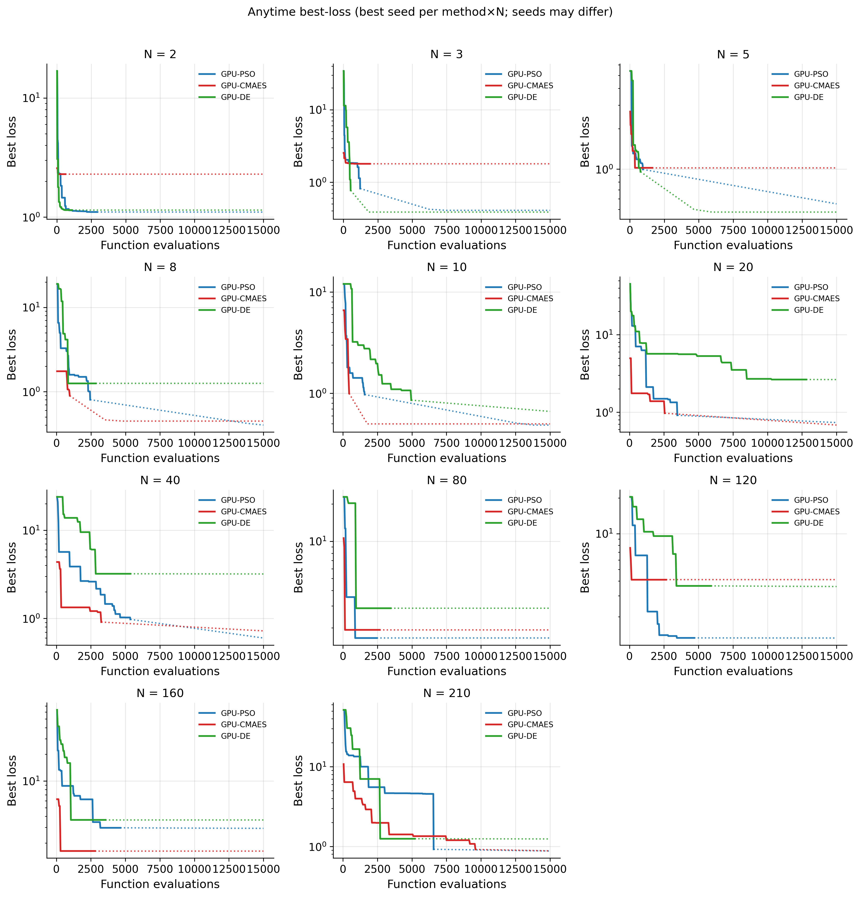
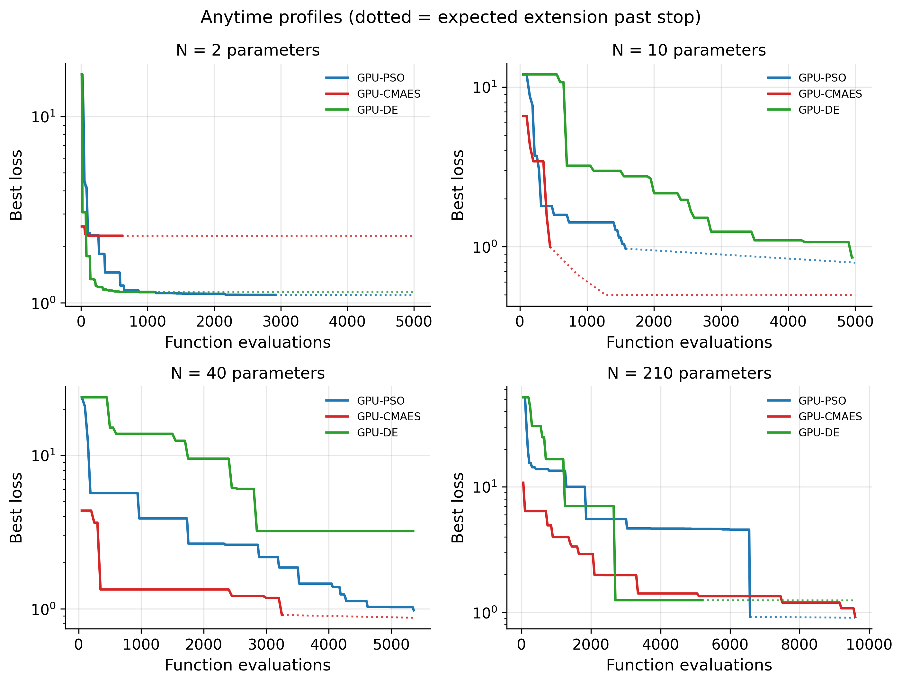
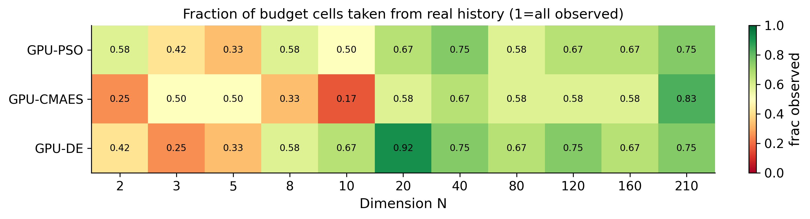
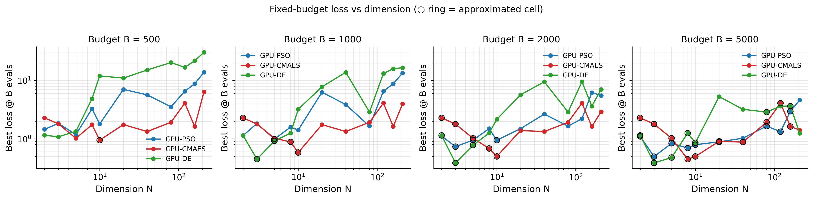
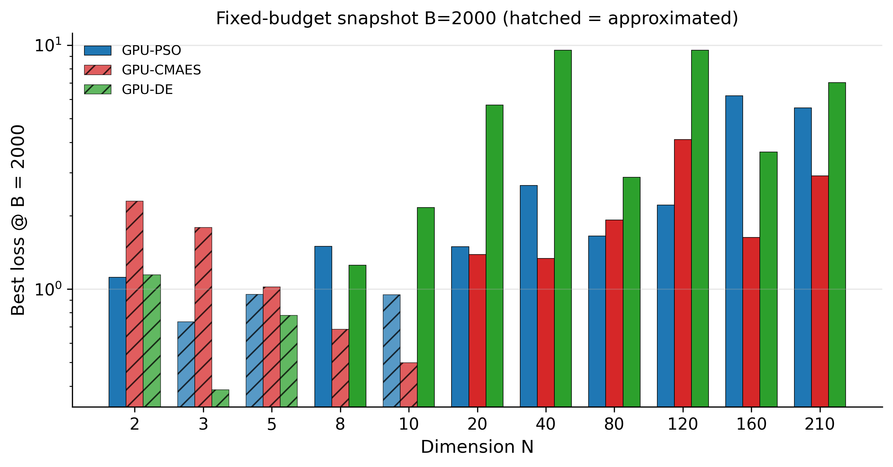
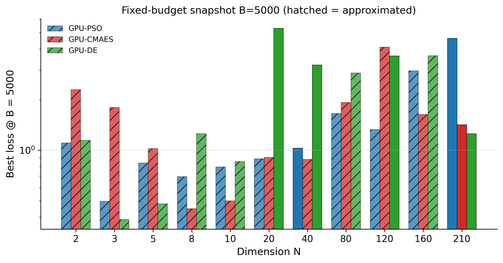
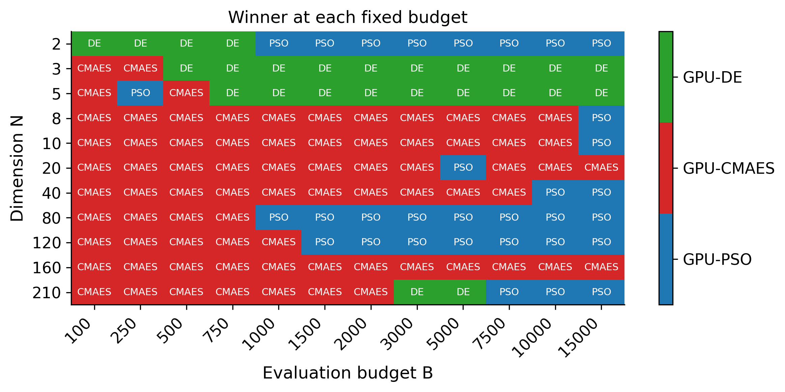

# Fixed-budget analysis: GPU-PSO vs GPU-CMAES vs GPU-DE

## Scope and data (history + best-of-seeds)

Primary data are **completed historical runs** from any seed available. **Seeds are not required to match** across methods. When several seeds exist for the same `(method, N)`, the analysis keeps the run with the **lowest final loss** and uses that anytime curve for fixed-budget readouts. Budget cells beyond early stops use documented approximations.

- **GPU-PSO**: `Fixed-budget/from_table/_stage/GPU-PSO/` (+ seed2 dirs when present)
- **GPU-CMAES**: `Fixed-budget/from_table/_stage/GPU-CMAES/` (+ seed2 dirs when present)
- **GPU-DE**: `Fixed-budget/from_table/_stage/GPU-DE/` (+ seed2 dirs when present)

Dimensions: **[2, 3, 5, 8, 10, 20, 40, 80, 120, 160, 210]**.

### Selected run (best final_loss) per method × N

| method | n_params | seed | final_loss | total_evals | case |
| --- | --- | --- | --- | --- | --- |
| GPU-CMAES | 2 | 42 | 2.291 | 610 | 2P |
| GPU-DE | 2 | 42 | 1.144 | 1080 | 2P |
| GPU-PSO | 2 | 42 | 1.102 | 2920 | 2P |
| GPU-CMAES | 3 | 42 | 1.792 | 1920 | 3P |
| GPU-DE | 3 | 42 | 0.7712 | 525 | 3P |
| GPU-PSO | 3 | 42 | 0.8149 | 1216 | 3P |
| GPU-CMAES | 5 | 42 | 1.022 | 1625 | 5P |
| GPU-DE | 5 | 42 | 0.9562 | 775 | 5P |
| GPU-PSO | 5 | 42 | 0.9943 | 947 | 5P |
| GPU-CMAES | 8 | 42 | 0.8951 | 960 | 8P |
| GPU-DE | 8 | 42 | 1.252 | 2840 | 8P |
| GPU-PSO | 8 | 42 | 0.8032 | 2440 | 8P |
| GPU-CMAES | 10 | 42 | 0.9969 | 450 | 10P |
| GPU-DE | 10 | 42 | 0.8555 | 4950 | 10P |
| GPU-PSO | 10 | 42 | 0.9713 | 1576 | 10P |
| GPU-CMAES | 20 | 42 | 0.9708 | 2550 | 20P |
| GPU-DE | 20 | 42 | 2.643 | 12800 | 20P |
| GPU-PSO | 20 | 42 | 0.9136 | 3465 | 20P |
| GPU-CMAES | 40 | 42 | 0.9107 | 3250 | 40P |
| GPU-DE | 40 | 42 | 3.213 | 5350 | 40P |
| GPU-PSO | 40 | 42 | 0.9771 | 5359 | 40P |
| GPU-CMAES | 80 | 42 | 1.922 | 2650 | 80P |
| GPU-DE | 80 | 42 | 2.876 | 3450 | 80P |
| GPU-PSO | 80 | 42 | 1.651 | 2453 | 80P |
| GPU-CMAES | 120 | 42 | 4.099 | 2650 | 120P |
| GPU-DE | 120 | 42 | 3.636 | 5900 | 120P |
| GPU-PSO | 120 | 42 | 1.327 | 4685 | 120P |
| GPU-CMAES | 160 | 42 | 1.627 | 2800 | 160P |
| GPU-DE | 160 | 42 | 3.646 | 3550 | 160P |
| GPU-PSO | 160 | 42 | 2.97 | 4633 | 160P |
| GPU-CMAES | 210 | 42 | 0.9191 | 9600 | 210P |
| GPU-DE | 210 | 42 | 1.25 | 5200 | 210P |
| GPU-PSO | 210 | 42 | 0.9227 | 6571 | 210P |

### Approximation rules

| fill_kind | When used | Expected meaning |
|---|---|---|
| `observed` | B within logged evals | Real best-so-far from history |
| `approx_pre_first` | B < first generation cost | Use first recorded best (generation incomplete) |
| `approx_hold_final` | B > T and Stop A/B | Converged/stagnated → nearly flat (85% hold + 15% soft slope) |
| `approx_soft_extend` | B > T and Stop C/other | log-linear residual descent with damping |
| `approx_dim_interp` | Missing method×N | log-N interpolation from neighbor dimensions |

### Fill counts (best-seed table)

| fill_kind | count |
| --- | --- |
| observed | 226 |
| approx_soft_extend | 86 |
| approx_hold_final | 84 |

Observed fraction overall: **57.1%** of (method, N, B) cells.

Budget grid: `100, 250, 500, 750, 1000, 1500, 2000, 3000, 5000, 7500, 10000, 15000`

## Run inventory (selected best seed)

| method | n_params | seed | is_approx_run | final_loss | total_evals | stop_reason | time_h |
| --- | --- | --- | --- | --- | --- | --- | --- |
| GPU-CMAES | 2 | 42 | False | 2.291 | 610 | Stop B (long stagnation): rel_imp flat 50 iters (≥50) | 0.9066 |
| GPU-DE | 2 | 42 | False | 1.144 | 1080 | Stop B (long stagnation): rel_imp flat 50 iters (≥50) | 1.57 |
| GPU-PSO | 2 | 42 | False | 1.102 | 2920 | Stop B (long stagnation): rel_imp flat 50 iters (≥50) | 4.253 |
| GPU-CMAES | 3 | 42 | False | 1.792 | 1920 | Stop B (long stagnation): rel_imp flat 50 iters (≥50) | 2.248 |
| GPU-DE | 3 | 42 | False | 0.7712 | 525 | Stop L (loss target): best_loss=0.771241 < 1.0 | 0.6723 |
| GPU-PSO | 3 | 42 | False | 0.8149 | 1216 | Stop L (loss target): best_loss=0.81485 < 1.0 | 1.751 |
| GPU-CMAES | 5 | 42 | False | 1.022 | 1625 | Stop B (long stagnation): rel_imp flat 50 iters (≥50) | 2.061 |
| GPU-DE | 5 | 42 | False | 0.9562 | 775 | Stop L (loss target): best_loss=0.956215 < 1.0 | 1.019 |
| GPU-PSO | 5 | 42 | False | 0.9943 | 947 | Stop L (loss target): best_loss=0.994268 < 1.0 | 1.163 |
| GPU-CMAES | 8 | 42 | False | 0.8951 | 960 | Stop L (loss target): best_loss=0.895063 < 1.0 | 1.133 |
| GPU-DE | 8 | 42 | False | 1.252 | 2840 | Stop B (long stagnation): rel_imp flat 50 iters (≥50) | 2.064 |
| GPU-PSO | 8 | 42 | False | 0.8032 | 2440 | Stop L (loss target): best_loss=0.803177 < 1.0 | 3.168 |
| GPU-CMAES | 10 | 42 | False | 0.9969 | 450 | Stop L (loss target): best_loss=0.996912 < 1.0 | 0.5591 |
| GPU-DE | 10 | 42 | False | 0.8555 | 4950 | Stop L (loss target): best_loss=0.855548 < 1.0 | 6.526 |
| GPU-PSO | 10 | 42 | False | 0.9713 | 1576 | Stop L (loss target): best_loss=0.971297 < 1.0 | 1.972 |
| GPU-CMAES | 20 | 42 | False | 0.9708 | 2550 | Stop L (loss target): best_loss=0.970797 < 1.0 | 3.063 |
| GPU-DE | 20 | 42 | False | 2.643 | 12800 | Stop B (long stagnation): rel_imp flat 50 iters (≥50) | 17.48 |
| GPU-PSO | 20 | 42 | False | 0.9136 | 3465 | Stop L (loss target): best_loss=0.913571 < 1.0 | 4.554 |
| GPU-CMAES | 40 | 42 | False | 0.9107 | 3250 | Stop L (loss target): best_loss=0.910665 < 1.0 | 3.803 |
| GPU-DE | 40 | 42 | False | 3.213 | 5350 | Stop B (long stagnation): rel_imp flat 50 iters (≥50) | 7.985 |
| GPU-PSO | 40 | 42 | False | 0.9771 | 5359 | Stop L (loss target): best_loss=0.977128 < 1.0 | 7.271 |
| GPU-CMAES | 80 | 42 | False | 1.922 | 2650 | Stop B (long stagnation): rel_imp flat 50 iters (≥50) | 4.437 |
| GPU-DE | 80 | 42 | False | 2.876 | 3450 | Stop B (long stagnation): rel_imp flat 50 iters (≥50) | 5.564 |
| GPU-PSO | 80 | 42 | False | 1.651 | 2453 | Stop B (long stagnation): rel_imp flat 50 iters (≥50) | 3.883 |
| GPU-CMAES | 120 | 42 | False | 4.099 | 2650 | Stop B (long stagnation): rel_imp flat 50 iters (≥50) | 3.804 |
| GPU-DE | 120 | 42 | False | 3.636 | 5900 | Stop B (long stagnation): rel_imp flat 50 iters (≥50) | 9.805 |
| GPU-PSO | 120 | 42 | False | 1.327 | 4685 | Stop B (long stagnation): rel_imp flat 50 iters (≥50) | 7.599 |
| GPU-CMAES | 160 | 42 | False | 1.627 | 2800 | Stop B (long stagnation): rel_imp flat 50 iters (≥50) | 3.672 |
| GPU-DE | 160 | 42 | False | 3.646 | 3550 | Stop B (long stagnation): rel_imp flat 50 iters (≥50) | 5.531 |
| GPU-PSO | 160 | 42 | False | 2.97 | 4633 | Stop B (long stagnation): rel_imp flat 50 iters (≥50) | 8.221 |
| GPU-CMAES | 210 | 42 | False | 0.9191 | 9600 | Stop L (loss target): best_loss=0.919103 < 1.0 | 16.82 |
| GPU-DE | 210 | 42 | False | 1.25 | 5200 | Stop B (long stagnation): rel_imp flat 50 iters (≥50) | 7.405 |
| GPU-PSO | 210 | 42 | False | 0.9227 | 6571 | Stop L (loss target): best_loss=0.922727 < 1.0 | 10 |

## Anytime performance







## Fixed-budget snapshots









### Win counts

| method | wins | cells | win_rate | wins_with_approx |
| --- | --- | --- | --- | --- |
| GPU-PSO | 32 | 132 | 0.242 | 22 |
| GPU-CMAES | 75 | 132 | 0.568 | 27 |
| GPU-DE | 25 | 132 | 0.189 | 17 |

### Mean rank at B = 2000

| method | mean_rank |
| --- | --- |
| GPU-PSO | 1.909 |
| GPU-CMAES | 1.727 |
| GPU-DE | 2.364 |

## Key findings @ focus budgets (best seed + approx fill)

### Budget B = 1000

| n_params | GPU-PSO | GPU-CMAES | GPU-DE |
| --- | --- | --- | --- |
| 2 | 1.139 | 2.291 | 1.144 |
| 3 | 1.83 | 1.794 | 0.4471 |
| 5 | 0.9921 | 1.022 | 0.921 |
| 8 | 1.588 | 0.8859 | 1.252 |
| 10 | 1.418 | 0.5816 | 3.218 |
| 20 | 6.304 | 1.754 | 7.807 |
| 40 | 3.879 | 1.335 | 13.84 |
| 80 | 1.651 | 1.922 | 2.876 |
| 120 | 6.567 | 4.099 | 13.23 |
| 160 | 8.812 | 1.627 | 15.94 |
| 210 | 13.45 | 3.985 | 16.65 |

Fill tags:

| n_params | GPU-PSO | GPU-CMAES | GPU-DE |
| --- | --- | --- | --- |
| 2 | observed | approx_hold_final | observed |
| 3 | observed | observed | approx_soft_extend |
| 5 | approx_soft_extend | observed | approx_soft_extend |
| 8 | observed | approx_soft_extend | observed |
| 10 | observed | approx_soft_extend | observed |
| 20 | observed | observed | observed |
| 40 | observed | observed | observed |
| 80 | observed | observed | observed |
| 120 | observed | observed | observed |
| 160 | observed | observed | observed |
| 210 | observed | observed | observed |

- Wins: GPU-CMAES ×7, GPU-PSO ×2, GPU-DE ×2 → **GPU-CMAES**.

### Budget B = 2000

| n_params | GPU-PSO | GPU-CMAES | GPU-DE |
| --- | --- | --- | --- |
| 2 | 1.117 | 2.291 | 1.144 |
| 3 | 0.735 | 1.792 | 0.3856 |
| 5 | 0.9512 | 1.022 | 0.7794 |
| 8 | 1.498 | 0.684 | 1.252 |
| 10 | 0.9473 | 0.4985 | 2.163 |
| 20 | 1.492 | 1.386 | 5.681 |
| 40 | 2.659 | 1.335 | 9.531 |
| 80 | 1.651 | 1.922 | 2.876 |
| 120 | 2.21 | 4.099 | 9.552 |
| 160 | 6.215 | 1.627 | 3.646 |
| 210 | 5.544 | 2.917 | 7.03 |

Fill tags:

| n_params | GPU-PSO | GPU-CMAES | GPU-DE |
| --- | --- | --- | --- |
| 2 | observed | approx_hold_final | approx_hold_final |
| 3 | approx_soft_extend | approx_hold_final | approx_soft_extend |
| 5 | approx_soft_extend | approx_hold_final | approx_soft_extend |
| 8 | observed | approx_soft_extend | observed |
| 10 | approx_soft_extend | approx_soft_extend | observed |
| 20 | observed | observed | observed |
| 40 | observed | observed | observed |
| 80 | observed | observed | observed |
| 120 | observed | observed | observed |
| 160 | observed | observed | observed |
| 210 | observed | observed | observed |

- Wins: GPU-CMAES ×6, GPU-PSO ×3, GPU-DE ×2 → **GPU-CMAES**.

### Budget B = 5000

| n_params | GPU-PSO | GPU-CMAES | GPU-DE |
| --- | --- | --- | --- |
| 2 | 1.102 | 2.291 | 1.144 |
| 3 | 0.4955 | 1.792 | 0.3856 |
| 5 | 0.8384 | 1.022 | 0.4781 |
| 8 | 0.6944 | 0.4475 | 1.252 |
| 10 | 0.7936 | 0.4985 | 0.8545 |
| 20 | 0.8874 | 0.9058 | 5.312 |
| 40 | 1.026 | 0.8799 | 3.213 |
| 80 | 1.651 | 1.922 | 2.876 |
| 120 | 1.327 | 4.099 | 3.636 |
| 160 | 2.968 | 1.627 | 3.646 |
| 210 | 4.628 | 1.416 | 1.25 |

Fill tags:

| n_params | GPU-PSO | GPU-CMAES | GPU-DE |
| --- | --- | --- | --- |
| 2 | approx_hold_final | approx_hold_final | approx_hold_final |
| 3 | approx_soft_extend | approx_hold_final | approx_soft_extend |
| 5 | approx_soft_extend | approx_hold_final | approx_soft_extend |
| 8 | approx_soft_extend | approx_soft_extend | approx_hold_final |
| 10 | approx_soft_extend | approx_soft_extend | approx_soft_extend |
| 20 | approx_soft_extend | approx_soft_extend | observed |
| 40 | observed | approx_soft_extend | observed |
| 80 | approx_hold_final | approx_hold_final | approx_hold_final |
| 120 | approx_hold_final | approx_hold_final | observed |
| 160 | approx_hold_final | approx_hold_final | approx_hold_final |
| 210 | observed | observed | observed |

- Wins: GPU-PSO ×4, GPU-CMAES ×4, GPU-DE ×3 → **GPU-PSO**.

## Normalized AUC (selected trajectories)

| n_params | GPU-PSO | GPU-CMAES | GPU-DE |
| --- | --- | --- | --- |
| 2 | 1.439 | 2.315 | 1.386 |
| 3 | 2.767 | 1.833 | 6.7 |
| 5 | 1.659 | 1.157 | 2.357 |
| 8 | 2.66 | 1.594 | 3.843 |
| 10 | 2.465 | 3.741 | 3.117 |
| 20 | 4.45 | 1.685 | 4.933 |
| 40 | 3.05 | 1.537 | 8.403 |
| 80 | 3.244 | 2.141 | 7.588 |
| 120 | 3.582 | 4.168 | 7.994 |
| 160 | 6.373 | 1.968 | 9.616 |
| 210 | 7.547 | 2.096 | 8.805 |

## Optional re-runs (approx budget cells only)

Early-stop extensions only — **not** required for seed matching.

| priority | seed | method | n_params | issue | detail | suggested_max_evals | action |
| --- | --- | --- | --- | --- | --- | --- | --- |
| high | -1 | GPU-DE | 3 | short_vs_peers | T=525 evals vs peer_max=1920; stop=other — large-B cells use approx_hold/soft | 5000 | Optional re-run with larger max_iter / disabled early stop for fixed-budget fairness at high B |
| high | -1 | GPU-DE | 5 | short_vs_peers | T=775 evals vs peer_max=1625; stop=other — large-B cells use approx_hold/soft | 5000 | Optional re-run with larger max_iter / disabled early stop for fixed-budget fairness at high B |
| high | -1 | GPU-CMAES | 8 | short_vs_peers | T=960 evals vs peer_max=2840; stop=other — large-B cells use approx_hold/soft | 5000 | Optional re-run with larger max_iter / disabled early stop for fixed-budget fairness at high B |
| high | -1 | GPU-CMAES | 10 | short_vs_peers | T=450 evals vs peer_max=4950; stop=other — large-B cells use approx_hold/soft | 5000 | Optional re-run with larger max_iter / disabled early stop for fixed-budget fairness at high B |
| high | -1 | GPU-PSO | 10 | short_vs_peers | T=1576 evals vs peer_max=4950; stop=other — large-B cells use approx_hold/soft | 5000 | Optional re-run with larger max_iter / disabled early stop for fixed-budget fairness at high B |
| high | -1 | GPU-CMAES | 20 | short_vs_peers | T=2550 evals vs peer_max=12800; stop=other — large-B cells use approx_hold/soft | 12800 | Optional re-run with larger max_iter / disabled early stop for fixed-budget fairness at high B |
| high | -1 | GPU-PSO | 20 | short_vs_peers | T=3465 evals vs peer_max=12800; stop=other — large-B cells use approx_hold/soft | 12800 | Optional re-run with larger max_iter / disabled early stop for fixed-budget fairness at high B |
| medium | -1 | GPU-CMAES | 2 | short_vs_peers | T=610 evals vs peer_max=2920; stop=StopB — large-B cells use approx_hold/soft | 5000 | Optional re-run with larger max_iter / disabled early stop for fixed-budget fairness at high B |
| medium | -1 | GPU-CMAES | 2 | high_approx_fraction | 100% of key-budget cells are approximated | 15000 | Extend history at least to B=5000–15000 if affordable |
| medium | -1 | GPU-DE | 2 | short_vs_peers | T=1080 evals vs peer_max=2920; stop=StopB — large-B cells use approx_hold/soft | 5000 | Optional re-run with larger max_iter / disabled early stop for fixed-budget fairness at high B |
| medium | -1 | GPU-DE | 2 | high_approx_fraction | 100% of key-budget cells are approximated | 15000 | Extend history at least to B=5000–15000 if affordable |
| medium | -1 | GPU-PSO | 2 | high_approx_fraction | 75% of key-budget cells are approximated | 15000 | Extend history at least to B=5000–15000 if affordable |
| medium | -1 | GPU-CMAES | 3 | high_approx_fraction | 100% of key-budget cells are approximated | 15000 | Extend history at least to B=5000–15000 if affordable |
| medium | -1 | GPU-DE | 3 | high_approx_fraction | 100% of key-budget cells are approximated | 15000 | Extend history at least to B=5000–15000 if affordable |
| medium | -1 | GPU-PSO | 3 | high_approx_fraction | 100% of key-budget cells are approximated | 15000 | Extend history at least to B=5000–15000 if affordable |
| medium | -1 | GPU-CMAES | 5 | high_approx_fraction | 100% of key-budget cells are approximated | 15000 | Extend history at least to B=5000–15000 if affordable |
| medium | -1 | GPU-DE | 5 | high_approx_fraction | 100% of key-budget cells are approximated | 15000 | Extend history at least to B=5000–15000 if affordable |
| medium | -1 | GPU-PSO | 5 | high_approx_fraction | 100% of key-budget cells are approximated | 15000 | Extend history at least to B=5000–15000 if affordable |
| medium | -1 | GPU-CMAES | 8 | high_approx_fraction | 100% of key-budget cells are approximated | 15000 | Extend history at least to B=5000–15000 if affordable |
| medium | -1 | GPU-DE | 8 | high_approx_fraction | 75% of key-budget cells are approximated | 15000 | Extend history at least to B=5000–15000 if affordable |
| medium | -1 | GPU-PSO | 8 | high_approx_fraction | 75% of key-budget cells are approximated | 15000 | Extend history at least to B=5000–15000 if affordable |
| medium | -1 | GPU-CMAES | 10 | high_approx_fraction | 100% of key-budget cells are approximated | 15000 | Extend history at least to B=5000–15000 if affordable |
| medium | -1 | GPU-DE | 10 | high_approx_fraction | 75% of key-budget cells are approximated | 15000 | Extend history at least to B=5000–15000 if affordable |
| medium | -1 | GPU-PSO | 10 | high_approx_fraction | 100% of key-budget cells are approximated | 15000 | Extend history at least to B=5000–15000 if affordable |
| medium | -1 | GPU-CMAES | 20 | high_approx_fraction | 75% of key-budget cells are approximated | 15000 | Extend history at least to B=5000–15000 if affordable |

## Tables

| File | Content |
|---|---|
| `tables/selected_best_seed_runs.csv` | Chosen seed per method×N |
| `tables/seed_choice_by_method_dim.csv` | All candidate seeds (selected flag) |
| `tables/fixed_budget_long_best_seed.csv` | Loss+fill for every cell |
| `tables/fixed_budget_wide_B*.csv` | Loss pivots |
| `tables/winners_best_seed.csv` | Winners |
| `tables/rerun_todo.csv` | Optional re-runs |

## How to regenerate

```bash
cd ~/LCADAME/pvtR
python Fixed-budget/fixed_budget_analysis.py
```
